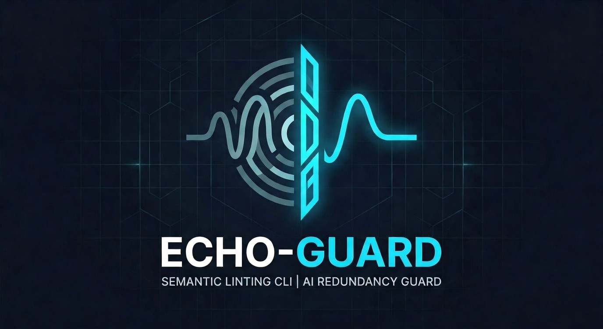

<p align="center">
  
</p>

<p align="center">
  <kbd><b><font size="24">Echo-Guard</font></b></kbd><br>
  <br>
  <strong>Semantic linting CLI for AI-generated code redundancy</strong>
</p>

<p align="center">
  
  
  
  
</p>

## What is Echo-Guard?

**Echo-Guard** is a semantic linting CLI designed to catch the subtle, functional duplication that AI coding agents often introduce.

Unlike traditional linters that focus on syntax errors or style, Echo-Guard analyzes the **logic and intent** of your code. It identifies "echoes"—blocks of code that perform the same task but might look slightly different—across your entire project, regardless of the file or service they live in.

## Why Echo-Guard?

AI-assisted development (Cursor, Claude Code, Copilot) is incredibly fast, but it has a "memory" problem. Agents often generate fresh code for a task that has already been solved elsewhere in your codebase.

Use Echo-Guard to:

- **Kill Hidden Redundancy:** Catch duplicate business logic that "grep" or simple string matching would miss.
- **Prevent "AI Rot":** Stop your codebase from bloating with slightly different versions of the same utility functions.
- **Keep Your Data Local:** Built for privacy-conscious teams. Echo-Guard runs entirely on your machine—no code is ever uploaded to the cloud for analysis, without opt-in for anonymized metadata for improving model.
- **Scale Across Languages:** Maintain a DRY (Don't Repeat Yourself) architecture even in polyglot repositories.

## Install

### Prerequisites

If you don't have `pipx` installed:

```bash
# macOS
brew install pipx && pipx ensurepath

# Linux / WSL
python3 -m pip install --user pipx && pipx ensurepath

# Windows (PowerShell)
pip install pipx
pipx ensurepath
```

### Install Echo Guard

```bash
pipx install "echo-guard[languages,mcp]"
```

## Getting Started

```bash
echo-guard setup
```

The setup wizard handles everything:

1. **Directory selection** — choose which directories to scan (interactive arrow-key selector)
2. **Language detection** — auto-detects languages in your selected directories
3. **MCP registration** — detects Claude Code and registers the MCP server automatically
4. **GitHub Action** — optionally generates `.github/workflows/echo-guard.yml` for PR checks
5. **Initial index + scan** — indexes your codebase and runs the first scan

One command, fully configured. The wizard generates `.echoguard.yml` with all settings.

### Manual workflow

If you prefer to skip the wizard:

```bash
echo-guard index        # Index your codebase
echo-guard scan         # Scan for duplicates
echo-guard review       # Walk through findings interactively
echo-guard add-mcp      # Register MCP server with Claude Code
echo-guard add-action   # Generate GitHub Action for PR checks
```

## Example Output

```text
#1 HIGH — T1/T2 Exact (98%)
  New code:  python services/auth/utils.py:12 → validate_email()
  Existing:  python services/user/validators.py:8 → validate_email()

  Suggested fix: from services.user.validators import validate_email

#2 MEDIUM — T4 Semantic (84%)
  New code:  python utils/auth.py:45 → hash_token()
  Existing:  python crypto/tokens.py:20 → generate_token_hash()

  Action: SAME INTENT, different implementation. Evaluate whether to reuse.
```

## How It Works

Echo Guard uses a two-tier detection pipeline that catches all four clone types:

### Tier 1 — AST Hash Matching (Type-1/Type-2)

Tree-sitter parses functions, normalizes identifiers, and computes structural hashes.
Two functions with the same hash are exact or renamed clones.
**O(n) — 100% recall, zero false positives.**

### Tier 2 — Code Embeddings (Type-3/Type-4)

[UniXcoder](https://github.com/microsoft/CodeBERT/tree/master/UniXcoder) encodes each function into a 768-dim embedding vector.
Cosine similarity search finds modified clones (same structure, different statements) and semantic clones (same intent, completely different implementation).
**~15ms per function, ~2ms search at 100K functions.**

Embedding thresholds are calibrated per language (Python: 0.94, Java: 0.81, JS: 0.85, Go: 0.81, C/C++: 0.83) to avoid false positives from shared language idioms.

### Clone Type Classification

| Finding               | Clone Type  | Severity   | Meaning                                                |
| --------------------- | ----------- | ---------- | ------------------------------------------------------ |
| AST hash match        | T1/T2 Exact | **HIGH**   | Exact or renamed duplicate — import instead            |
| Embedding ≥ threshold | T3 Modified | **HIGH**   | Very similar structure — refactor into shared function |
| Embedding ≥ threshold | T4 Semantic | **MEDIUM** | Same intent, different code — evaluate reuse           |

## MCP Integration

Echo Guard includes a built-in MCP server so AI agents can check for duplicates before generating new functions. Supported agents:

- **Claude Code** — auto-detected and registered via `claude mcp add`
- **Codex** — auto-detected and registered via `codex mcp add`

The MCP server is registered automatically during `echo-guard setup`, or manually via `echo-guard add-mcp`. It provides:

| Tool                      | Description                                            |
| ------------------------- | ------------------------------------------------------ |
| `check_for_duplicates`    | Check code for duplicates (before/after writing)       |
| `resolve_finding`         | Record verdict: fixed, acknowledged, or false_positive |
| `respond_to_probe`        | Evaluate a low-confidence match for training data      |
| `get_finding_resolutions` | View resolution history and stats                      |
| `search_functions`        | Search index by function name, keyword, or language    |
| `suggest_refactor`        | Get consolidation suggestions                          |
| `get_index_stats`         | View index statistics                                  |
| `get_codebase_clusters`   | Understand code grouping                               |

<details>
<summary>Manual MCP registration</summary>

```bash
# Claude Code
claude mcp add echo-guard -- "$(pipx environment --value PIPX_LOCAL_VENVS)/echo-guard/bin/python" -m echo_guard.mcp_server

# Codex
codex mcp add echo-guard -- "$(pipx environment --value PIPX_LOCAL_VENVS)/echo-guard/bin/python" -m echo_guard.mcp_server
```
</details>

## Supported Languages

Python, JavaScript, TypeScript, Go, Rust, Java, Ruby, C, C++

Cross-language matching is supported.

## CLI Reference

| Command                    | Description                         |
| -------------------------- | ----------------------------------- |
| `echo-guard setup`         | Interactive setup wizard            |
| `echo-guard scan`          | Scan for redundant code             |
| `echo-guard scan -v`       | Show detailed match table           |
| `echo-guard review`        | Interactive review of all findings  |
| `echo-guard add-mcp`       | Register MCP server (Claude/Codex)  |
| `echo-guard add-action`    | Generate GitHub Action workflow     |
| `echo-guard index`         | Index codebase                      |
| `echo-guard check FILES`   | Check specific files                |
| `echo-guard watch`         | Watch files in real time            |
| `echo-guard health`        | Compute codebase health             |
| `echo-guard acknowledge`   | Acknowledge a single finding by ID  |
| `echo-guard training-data` | View/export collected training data |
| `echo-guard clear-index`   | Clear index                         |

## Configuration

Everything lives in `.echoguard.yml`, generated by `echo-guard setup`:

```yaml
# Detection settings
threshold: 0.50              # General similarity floor (after scope penalties)
min_function_lines: 3        # Skip functions shorter than this
max_function_lines: 500      # Skip functions longer than this

# Languages to scan
languages:
  - python
  - javascript
  - typescript

# CI behavior (used by GitHub Action)
fail_on: high                # high, medium, or none

# Directories to exclude from scanning
ignore:
  - docs/
  - tests/
  - benchmarks/

# Service boundaries for monorepo-aware suggestions
# service_boundaries:
#   - services/worker
#   - services/dashboard

# Acknowledged findings — suppressed in CI and future scans
# Run `echo-guard review` to add entries interactively
acknowledged:
  - echo_guard/cli.py:scan||echo_guard/cli.py:check
```

### What each setting does

| Setting | Default | Description |
|---|---|---|
| `threshold` | `0.50` | Minimum similarity score after scope penalties. Functions with private/internal visibility get penalized — this floor determines if penalized matches are still shown. |
| `min_function_lines` | `3` | Functions shorter than this are skipped (getters, one-liners). |
| `max_function_lines` | `500` | Functions longer than this are skipped (generated code, data dumps). |
| `languages` | all 9 | Which languages to scan. Restricting this speeds up indexing. |
| `fail_on` | `high` | Minimum severity that fails the CI check. `none` = advisory only. |
| `ignore` | `[]` | Directories/patterns to exclude from scanning (gitignore-style). |
| `acknowledged` | `[]` | Finding IDs that have been reviewed and accepted. These are suppressed in CI and in `echo-guard review`. |

Local artifacts are stored in `.echo-guard/` (gitignored):

```text
.echo-guard/
├── index.duckdb        # Function metadata and training data
├── embeddings.npy      # Code embedding vectors
├── embedding_meta.json # Embedding store metadata
├── scan-results.txt    # Latest scan report
└── model_cache/        # Cached UniXcoder ONNX model (~500MB, downloaded on first use)
```

## CI Integration

### GitHub Action

Generated automatically by `echo-guard setup`, or add manually to `.github/workflows/echo-guard.yml`:

```yaml
name: Echo Guard
on: [pull_request]
permissions:
  contents: read
  pull-requests: write
jobs:
  echo-guard:
    runs-on: ubuntu-latest
    steps:
      - uses: actions/checkout@v4
        with:
          fetch-depth: 0
      - uses: actions/setup-python@v5
        with:
          python-version: "3.12"
      - uses: jwizenfeld04/Echo-Guard@v0.2.0
        with:
          threshold: "0.50"
          fail-on: "high"
          comment: "true"
```

### Acknowledging Findings

When Echo Guard flags intentional duplication that blocks your PR:

```bash
echo-guard review
```

This walks through each finding with code previews:
- **a** = acknowledge (intentional duplication, suppress in CI)
- **f** = false positive (not a real clone, suppress and record as training data)
- **s** = skip (leave unresolved)

Acknowledged findings are saved to the `acknowledged` list in `.echoguard.yml`. Commit the file to suppress them in future CI runs.

## Privacy

- **No telemetry, no uploads** — everything runs locally on your machine
- **Training data** — when you resolve findings or respond to probes, code pairs are stored locally in `.echo-guard/index.duckdb` for future model improvement. This data never leaves your machine. See [FINE-TUNING.md](docs/FINE-TUNING.md) for details.
- **No cloud dependencies** — the embedding model runs locally via ONNX Runtime (CPU only)

## Benchmark Results

Echo Guard is evaluated against established academic clone detection benchmarks using the two-tier pipeline (AST hash + UniXcoder embeddings). Full analysis: **[BENCHMARKS.md](docs/BENCHMARKS.md)**

| Dataset                     | Precision | Recall | F1    | T4 Recall | Pairs |
| --------------------------- | --------- | ------ | ----- | --------- | ----- |
| BigCloneBench (Java)        | 95.2%     | 63.4%  | 76.1% | 0.0%      | 1,200 |
| GPTCloneBench (Java/Python) | 67.2%     | 97.2%  | 79.5% | 96.0%     | 600   |
| POJ-104 (C)                 | 76.5%     | 78.6%  | 77.5% | 78.6%     | 381   |

**Key results:**

- Perfect on Type-1/2 (exact/renamed clones) via AST hash matching
- **Type-3 recall: 58.5%** on BigCloneBench (up from 2% with TF-IDF)
- **Type-4 recall: 96%** on GPTCloneBench, **78.6%** on POJ-104 (up from 82% and 11%)
- 95.2% precision on BigCloneBench — very few false positives on human-written code

## Roadmap

- [x] **Benchmarking** — Validate against BigCloneBench, GPTCloneBench, POJ-104
- [x] **GitHub Action** — PR annotations, summary comments, severity-based gating
- [x] **Semantic detection** — UniXcoder embeddings for Type-3/Type-4 clone detection
- [ ] **VS Code extension** — Real-time inline diagnostics via MCP
- [ ] **LLM-assisted refactoring** — Automated consolidation patches
- [ ] **Monorepo scale** — Sharded indexing and parallel scanning

See [ROADMAP.md](docs/ROADMAP.md) for the full plan with details and rationale.

## Documentation

- [Architecture](docs/ARCHITECTURE.md) — Two-tier detection pipeline, clone types, storage, scaling
- [Benchmarks](docs/BENCHMARKS.md) — Results on BigCloneBench, GPTCloneBench, POJ-104
- [Type-4 Analysis](docs/TYPE4-ANALYSIS.md) — Why detection varies by dataset, with code samples
- [Fine-Tuning Roadmap](docs/FINE-TUNING.md) — Improving semantic detection through contrastive learning
- [Roadmap](docs/ROADMAP.md) — Development phases and planned features
- [Changelog](docs/CHANGELOG.md)

## License

MIT
