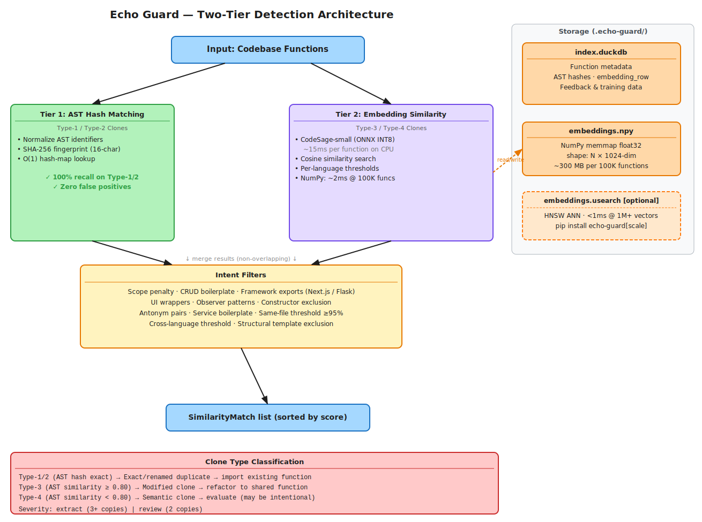

# Echo Guard Architecture

## Two-Tier Detection Pipeline

Echo Guard uses a two-tier architecture for code clone detection. Both tiers are included in the base install — no optional dependencies needed.

### Overview



> To edit: open [`architecture.excalidraw`](architecture.excalidraw) in [Excalidraw](https://excalidraw.com) or the Excalidraw VS Code extension.

### Tier 1: AST Hash Matching (Type-1/Type-2)

**Always active. Zero dependencies beyond tree-sitter.**

Tier 1 uses structural AST hashing to detect exact clones (Type-1) and renamed clones (Type-2) in O(1) time.

How it works:
1. Each function's AST is normalized: identifiers replaced with positional placeholders, comments/strings stripped, control flow structure preserved.
2. The normalized AST is SHA-256 hashed to a 16-char fingerprint.
3. Functions with identical AST hashes are exact structural clones (score = 1.0).

Performance:
- **100% recall** on Type-1 and Type-2 clones (BigCloneBench benchmark)
- **Zero false positives** — AST hash identity means the code is structurally identical
- O(n) indexing, O(1) lookup via hash-map grouping

### Tier 2: Embedding Similarity (Type-3/Type-4)

Tier 2 uses learned code embeddings from [CodeSage-small](https://github.com/amazon-science/CodeSage) to detect clones that share semantic meaning but have different syntax.

How it works:
1. Each function's source code is tokenized by the CodeSage tokenizer (max 1024 tokens).
2. The tokenized input runs through the ONNX-exported CodeSage-small model (INT8 quantized, ~200MB).
3. The last hidden states are mean-pooled and L2-normalized to produce a 1024-dim unit vector.
4. Cosine similarity between embeddings is computed via NumPy dot product.
5. Pairs above the per-language embedding threshold are reported as matches.

Why CodeSage-small:
- **Stronger semantic understanding**: Contrastive pre-training on code pairs produces richer embeddings than UniXcoder's masked language modeling objective
- **Apache-2.0 license**: Fully compatible with commercial use and Echo Guard's MIT license
- **1024-dim embeddings**: Richer representations than UniXcoder's 768-dim
- **Configurable**: Switch to `codesage-base` (higher Type-4 recall, ~3x slower) or `unixcoder` (legacy) via `echo-guard.yml`

Performance:
- Per-function embedding: **~10-20ms** on CPU (ONNX INT8)
- Similarity search at 100K functions: **~1-2ms** (NumPy brute-force)
- Model cached locally after first download (~200MB ONNX INT8)

---

## Storage Architecture

```text
Committed to git:
└── echo-guard.yml              # Config, ignore patterns, and acknowledged findings

Gitignored (local artifacts):
└── .echo-guard/
    ├── index.duckdb            # Function metadata, feedback, training data
    ├── embeddings.npy          # NumPy memmap embedding vectors
    ├── embedding_meta.json     # Embedding store metadata
    ├── embeddings.usearch      # USearch ANN index (only with [scale])
    └── model_cache/            # Cached ONNX model (downloaded on first use)
```

### DuckDB Index (`index.duckdb`)

Persistent storage for all function metadata. Schema:

```sql
functions (
    qualified_name VARCHAR PRIMARY KEY,  -- "filepath:name:lineno"
    name VARCHAR,                         -- Function name
    filepath VARCHAR,                     -- Relative file path
    language VARCHAR,                     -- "python", "java", etc.
    lineno INTEGER,                       -- Start line
    end_lineno INTEGER,                   -- End line
    source TEXT,                          -- Full source code
    ast_hash VARCHAR,                     -- Normalized AST fingerprint
    param_count INTEGER,                  -- Parameter count
    has_return BOOLEAN,                   -- Has non-empty return?
    class_name VARCHAR,                   -- Enclosing class (if method)
    visibility VARCHAR,                   -- "public", "private", "internal"
    embedding_row INTEGER,                -- Index into embeddings.npy
    embedding_version VARCHAR,            -- Model version for invalidation
    ...
)
```

### Embedding Store (`embeddings.npy`)

Memory-mapped NumPy array of pre-computed, unit-normalized embedding vectors.

- Format: float32, shape (capacity, 1024) for CodeSage-small/base; 768 for legacy UniXcoder
- Storage: ~300MB per 100K functions
- Access: OS pages in only needed portions (RAM-efficient)
- Deletion: Lazy via bitmap in `embedding_meta.json`; periodic compaction reclaims space

### USearch Index (`embeddings.usearch`) — Optional

For codebases with >500K functions, USearch provides HNSW-based approximate nearest neighbor search.

Install: `pip install "echo-guard[scale]"`

- Automatically used when installed and index has >1,000 vectors
- Sub-millisecond search even at 1M+ vectors
- Supports incremental add and remove (unlike FAISS HNSW or Annoy)

---

## Intent Filters

Both tiers share a common set of intent filters that eliminate false positives. These run after similarity scoring and before results are returned.

| Filter | What it catches | Example |
|---|---|---|
| Scope penalty | Private/internal functions that can't be imported | `_helper()` with 0.6x penalty |
| Same-file threshold | Co-located functions that are intentionally separate | Requires ≥95% similarity |
| Cross-language threshold | Structural shape matches across languages | Requires ≥80% similarity |
| Constructor exclusion | Unrelated classes with similar `__init__` | `UserModel.__init__` vs `OrderModel.__init__` |
| Observer pattern | N classes implementing same interface method | `Protocol.on_event()` implementations |
| CRUD operations | Same-file create/update/delete on same resource | `create_user()` vs `update_user()` |
| Antonym pairs | Semantically inverse functions | `encrypt()` vs `decrypt()` |
| Structural templates | Same verb pattern, different domain nouns | `get_user_by_id()` vs `get_order_by_id()` |
| Framework exports | Next.js/Flask required per-file exports | `GET()` in different `route.ts` files |
| UI wrappers | Design system components sharing wrapper pattern | `Panel()`, `Card()`, `Badge()` |
| Service boilerplate | Health endpoints across microservices | `health()` in different services |
| Trivial one-liners | Single-statement methods with identical AST | `dispose()`, `refresh()`, getters/setters |

---

## Data Flow

### `echo-guard scan` (Full Repo)

```text
1. Load all functions from DuckDB index
2. Load EmbeddingModel (ONNX, cached on first use)
3. Compute embeddings for new/changed functions (incremental)
4. Store in memmap + update DuckDB embedding_row
5. Build SimilarityEngine with embedding store + model
4. Run find_all_matches():
   a. Tier 1: AST hash grouping → exact_structure matches
   b. Tier 2: batch_search() → embedding_semantic matches
   c. Apply intent filters to all candidates
   d. Merge (non-overlapping) and sort by score
5. Output results (rich/json/compact)
```

### `echo-guard check <files>` (Pre-commit)

```text
1. Load existing index into SimilarityEngine
2. For each changed file:
   a. Extract functions via tree-sitter
   b. Compute embedding (if available, ~15ms)
   c. find_similar() against full index:
      - Tier 1: AST hash lookup (O(1))
      - Tier 2: embedding search (~2ms)
      - Apply intent filters
3. Report matches to functions outside changed files
```

### MCP Server (`check_for_duplicates`)

```text
1. Receive proposed code from AI agent
2. Extract functions via tree-sitter
3. For each function:
   a. Compute embedding (~15ms)
   b. find_similar() against index (<50ms total)
4. Return matches + reuse suggestions
Total latency budget: <500ms
```

### Signal File IPC (`echo-guard notify`)

External processes (skills, CLI, pre-commit hooks) can trigger a VS Code diagnostics refresh without waiting for the next file-save check or 5-minute reindex:

```text
1. Any process touches .echo-guard/rescan.signal  (echo-guard notify)
2. Daemon's watchdog thread detects mtime change via inotify/FSEvents/kqueue
3. _trigger_background_rescan() runs scan in a daemon thread (no stdin/stdout block)
4. Daemon sends findings_refreshed notification over stdout JSON-RPC
5. VS Code extension receives notification (debounced 500ms) → refreshes diagnostics
Total latency: ~1-2 seconds (dominated by scan duration)
```

The watchdog uses native OS kernel events — zero CPU overhead when idle. Falls back silently if watchdog is unavailable.

---

## Clone Type Classification

Every finding is classified by clone type, following the standard academic taxonomy. Clone type is an **informational label** — it does not drive severity.

| Clone Type | Detection | What It Means |
|---|---|---|
| **Type-1/Type-2** | Tier 1 (AST hash exact match) | Structurally identical (modulo renames) |
| **Type-3** (AST similarity ≥ 0.80) | Tier 2 + `normalized_ast_similarity()` | Same structure with modifications |
| **Type-4** (AST similarity < 0.80) | Tier 2 + `normalized_ast_similarity()` | Same intent, different implementation |

Type-3 vs Type-4 classification uses `normalized_ast_similarity()` from `ast_distance.py`, which computes `1 - (edit_distance / max_tree_size)` via Zhang-Shasha tree edit distance. The 0.80 threshold means "up to 20% structural change still counts as a modified clone." This threshold is configurable via `type3_ast_threshold` in `echo-guard.yml`.

### Severity Model

Severity is **action-oriented and DRY-based**, determined by copy count rather than clone type:

| Level | Copies | What It Means | Action |
|---|---|---|---|
| **`extract`** | 3+ | Real DRY violation | Extract to shared module now |
| **`review`** | 2 | Worth noting | Defer per Rule of Three |

- **`extract`**: 3+ copies of the same function across the codebase, OR a file with 2+ review findings (file-concentration elevation). This is a clear DRY violation — extract to a shared module.
- **`review`**: 2 copies (a pair). Worth noting but may be intentional. Defer per the Rule of Three.

There are only two severity levels. Per-language embedding thresholds filter out false positives from shared language idioms. If a clone is detected, it's worth reporting.

### MCP Server Response Format

When the AI agent calls `check_for_duplicates`, each duplicate includes:

```json
{
  "finding_id": "utils/validators.py:validate_email||services/auth.py:validate_email",
  "clone_type": "type1_type2",
  "severity": "review",
  "similarity": 0.98,
  "your_function": "validate_email",
  "existing_function": "validate_email",
  "existing_file": "utils/validators.py:42",
  "action": "EXACT DUPLICATE. Import the existing function instead of rewriting it.",
  "fix": "from utils.validators import validate_email"
}
```

The response is compact (~50 tokens per finding). Source code is not included — the agent has the `existing_file` reference to read it if needed. The `action` field gives a single, unambiguous instruction.

---

## Claude Code Skills

Echo Guard ships four slash-command skills for users who prefer slash commands over MCP tools. Skills are bundled in `echo_guard/skills/` and installed via:

```bash
echo-guard install-skills           # → .claude/skills/ in current project
echo-guard install-skills --global  # → ~/.claude/skills/ (all sessions)
```

Skills are also offered during `echo-guard setup`.

| Skill | File | Description |
|---|---|---|
| `/echo-guard` | `echo-guard.md` | Scan/check, structured severity breakdown, prompt for EXTRACT findings |
| `/echo-guard-refactor` | `echo-guard-refactor.md` | Side-by-side comparison, AI refactoring, `acknowledge` + `notify` |
| `/echo-guard-review` | `echo-guard-review.md` | Interactive triage of all unresolved findings, batch verdict recording |
| `/echo-guard-search` | `echo-guard-search.md` | Function search against DuckDB index by name, source, or call names |

Skills call the same CLI commands as humans do — `echo-guard scan`, `echo-guard check`, `echo-guard acknowledge`, `echo-guard notify`, `echo-guard search` — so behavior is identical to running those commands manually.

---

## Embedding Model Details

### CodeSage-small (`codesage/codesage-small-v2`) — Default

| Property | Value |
|---|---|
| Architecture | GPT-NeoX-based encoder |
| Parameters | ~130M |
| Embedding dimensions | 1024 |
| Max tokens | 1024 |
| License | Apache-2.0 |
| Pre-training data | Contrastive training on code pairs (9 languages) |
| Training objective | Contrastive learning on code pairs |

### CodeSage-base (`codesage/codesage-base-v2`) — Higher Type-4 Recall

Same architecture as small but larger (280M params, ~341MB ONNX). ~3x slower inference (189ms/func vs 58ms/func). **Not uniformly better than small** — benchmarks show it trades Type-3 recall for Type-4 recall:

- GPTCloneBench Type-4: **82%** (vs 78.5% for small) ↑
- POJ-104 Type-4: **4.3%** (vs 1.1% for small) ↑
- BCB Type-3: **1.2%** (vs 4.0% for small) ↓

Recommended when semantic clone detection (same logic, different implementation) matters more than speed, and you can accept lower Type-3 recall.

### UniXcoder (`microsoft/unixcoder-base`) — Legacy

| Property | Value |
|---|---|
| Architecture | RoBERTa-based encoder-decoder |
| Parameters | ~125M |
| Embedding dimensions | 768 |
| Max tokens | 512 |
| ONNX size | ~125MB INT8 |

### ONNX Optimization

All models are exported to ONNX format with INT8 dynamic quantization:

1. **Export**: HuggingFace Optimum or direct `torch.onnx.export`
2. **Quantize**: INT8 dynamic quantization (significant size reduction)
3. **Runtime**: ONNX Runtime with CPU ExecutionProvider
4. **Speedup**: 3-5x over vanilla PyTorch inference

First-time setup downloads and converts the model automatically. Subsequent runs use the cached ONNX model.

---

## Configuration

### Install Tiers

```bash
# Standard install — includes Tier 1 (AST hash) + Tier 2 (CodeSage-small embeddings)
pip install echo-guard

# With language support (tree-sitter grammars)
pip install "echo-guard[languages]"

# Scale: Add USearch ANN for >500K function codebases
pip install "echo-guard[scale]"

# Full stack
pip install "echo-guard[languages,scale]"
```

Embeddings are included in the base install. The model (~200MB for CodeSage-small) is downloaded on first use and cached locally.

### Embedding Threshold

Embedding thresholds are **calibrated per language** using empirical measurements of clone vs non-clone similarity distributions. CodeSage-small produces different cosine similarity ranges for different languages — Python functions cluster very tightly, while Java/Go have cleaner separation.

| Language | Threshold | Clone Range | Noise Ceiling | Gap |
|---|---|---|---|---|
| Python | **0.94** | 0.92-0.97 | 0.96 | Overlaps — highest threshold needed |
| JavaScript | **0.85** | 0.88-0.91 | 0.78 | Clean gap |
| TypeScript | **0.83** | 0.93 | 0.59 | Wide gap |
| Java | **0.81** | 0.87-0.94 | 0.66 | Wide gap |
| Go | **0.81** | 0.89 | 0.64 | Wide gap |
| C/C++ | **0.83** | 0.90 | 0.69 | Clean gap |
| Ruby | **0.85** | Estimated | Estimated | Estimated from JS |
| Rust | **0.83** | Estimated | Estimated | Estimated from C/C++ |

For cross-language pairs, the lower threshold of the two languages is used.

These thresholds are defined in `echo_guard/embeddings.py:LANGUAGE_EMBEDDING_THRESHOLDS` and can be overridden in configuration.

### Model Selection

CodeSage-small is the default model. To use a different model, set `model` in `echo-guard.yml`:

```yaml
model: codesage-base   # Higher Type-4 recall, ~3x slower (~341MB)
# model: unixcoder    # Legacy 768-dim model
```

Or programmatically:

```python
from echo_guard.embeddings import EmbeddingModel

model = EmbeddingModel(model_name="codesage-base")
```

---

## Scaling Characteristics

| Metric | 1K functions | 10K functions | 100K functions | 1M functions |
|---|---|---|---|---|
| Embedding storage | ~3 MB | ~30 MB | ~300 MB | ~3 GB |
| Embedding computation | ~15s | ~2.5 min | ~25 min | ~4 hr |
| Brute-force search | <1ms | <1ms | ~2ms | ~20ms |
| USearch ANN search | <1ms | <1ms | <1ms | <1ms |
| RAM (engine) | ~10 MB | ~50 MB | ~400 MB | ~4 GB |
| RAM (with USearch) | ~10 MB | ~50 MB | ~200 MB | ~2 GB |

Notes:
- Embedding computation is **incremental** — only new/changed functions are embedded
- After first scan, subsequent scans only embed changed files
- Memory-mapped storage keeps RAM usage proportional to active queries, not total index size
